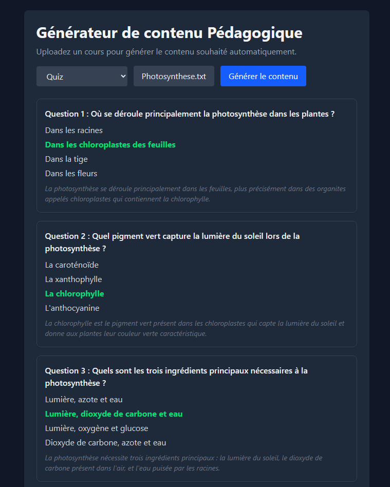

# Générateur de Contenu Pédagogique

Application web qui génère automatiquement du contenu pédagogique (quiz, fiches de synthèse) à partir d'un cours.

🔗 **Démo en ligne** : https://formation-assistant.vercel.app/



## Fonctionnalités

- Upload d'un cours (PDF ou texte)
- Génération de **quiz** à choix multiples avec corrigés et explications
- Génération de **fiches de synthèse** organisées en sections thématiques
- Interface web réactive avec gestion des états (chargement, erreurs)

## Stack technique

- **Frontend** : React (Vite) + Tailwind CSS, déployé sur Vercel
- **Backend** : FastAPI (Python), déployé sur Render
- **IA** : API Anthropic (Claude), génération structurée via tool use
- **Architecture** : API REST découplée (frontend et backend indépendants)

## Comment ça marche

L'utilisateur upload un cours, le backend en extrait le texte, puis appelle le LLM pour générer le contenu demandé. La sortie est garantie structurée grâce au **tool use** de l'API Anthropic, validée par des modèles **Pydantic** (cohérence des données).

## Installation locale

### Backend
```bash
cd backend
pip install -r requirements.txt
# créer un fichier .env avec : ANTHROPIC_API_KEY=votre_clé
uvicorn main:app --reload
```

### Frontend
```bash
cd frontend
npm install
npm run dev
```

## Limitations & améliorations possibles

- Le backend est hébergé sur l'offre gratuite de Render : le premier chargement après une période d'inactivité peut prendre 30 à 60 secondes (mise en veille du service).
- Améliorations envisagées : édition du contenu généré, export PDF, agent d'auto-évaluation de la qualité des quiz, support du RAG pour les documents volumineux, ajout de différents contenus.